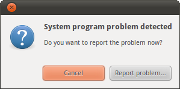

Recently I've noticed that just about everytime Ubuntu16.04
loads up, I get a "System Program Detected" pop-up at the top left
of the Desktop Environment. Additionally, they have become more frequent
during regular use, so I decided to get rid of the pop-up.



The solution to this is a simple edit of a priveliged file
`/etc/default/apport`. This file should contain the line `enabled=1`
and all you have to do is change that to `enabled=0` to get rid
of the pop-up.

Since the file is in a priveliged directory, you need to use `sudo`
when editing the file:

```
sudo gedit /etc/default/apport
```
OR 
```
sudo vim /etc/default/apport
```

After editing the file, it should look something like this:

```bash
# set this to 0 to disable apport, or to 1 to enable it
# you can temporarily override this with
# sudo service apport start force_start=1
enabled=0
```
